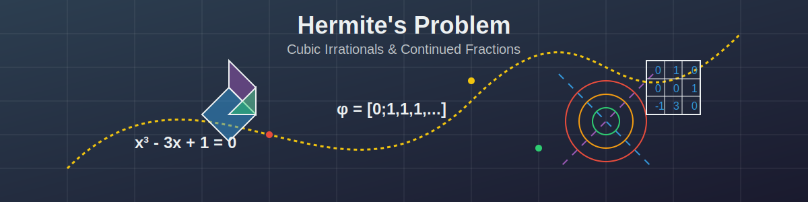

# Solving Hermite's Problem: Interactive Academic Paper



This repository contains an interactive academic paper exploring novel approaches to solving Hermite's Problem for cubic irrationals. The paper presents three complementary methods:

1. **HAPD Algorithm**: A projective space approach for detecting periodicity in cubic irrationals
2. **Matrix Approach**: Using companion matrices and trace sequences
3. **Modified sin²-Algorithm**: An adaptation for cubic irrationals with complex conjugate roots
4. **Subtractive Algorithm**: A numerically stable variation of the HAPD algorithm

## Interactive Features

The paper includes multiple interactive tools to help visualize and understand the algorithms:

- **Cubic Polynomial Explorer**: Visualize cubic polynomials and their roots
- **Projective Space Visualization**: Explore the HAPD algorithm in projective space
- **Matrix Trace Calculator**: Calculate trace sequences for companion matrices
- **Sin² Algorithm Demo**: Visualize the periodicity conditions for complex roots
- **Subtractive Algorithm Demo**: Explore the numerically stable variant of HAPD
- **Mathematical Notation Helper**: Tooltips and explanations for mathematical concepts

## Structure

- **`githubpages/`**: Contains the web version of the paper with all interactive elements
- **`arxiv_submission/`**: Contains the LaTeX source code for the paper submitted to arXiv
- **`figures/`**: Contains static visualizations and diagrams used in both versions

## How to Use

You can access the interactive paper in two ways:

1. **Online**: Visit [https://bbarclay.github.io/hermitesproblem](https://bbarclay.github.io/hermitesproblem)
2. **Locally**: Clone this repository and open `githubpages/index.html` or `githubpages/paper-viewer.html` in your browser

## Requirements for Local Viewing

- Modern web browser with JavaScript enabled
- Internet connection for loading external resources (optional)
- Local HTTP server (optional, for better experience)

## Citation

If you use this work in your research, please cite:

```
@article{hermite_problem2025,
  author = {Brandon Barclay},
  title = {Solving Hermite's Problem: Three Novel Approaches for Complete Characterization of Cubic Irrationals},
  year = {2025},
  journal = {arXiv preprint},
  url = {https://arxiv.org/abs/xxxx.xxxxx}
}
```

## License

This work is licensed under the Creative Commons Attribution 4.0 International License (CC-BY 4.0).

## Acknowledgments

- Charles Hermite for the original problem formulation
- The mathematical community for prior work on continued fractions and cubic irrationals
- Libraries used: MathJax, JSXGraph, Desmos, Bootstrap, Prism.js 