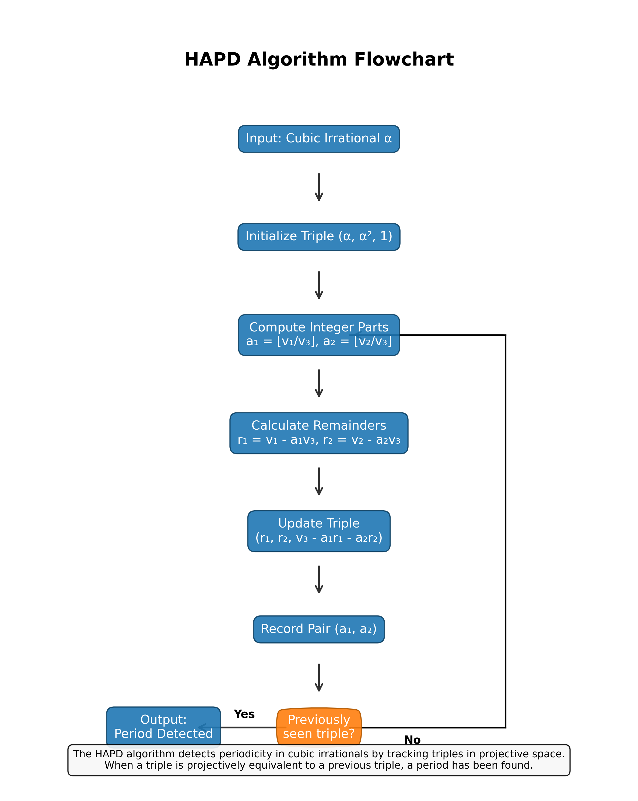
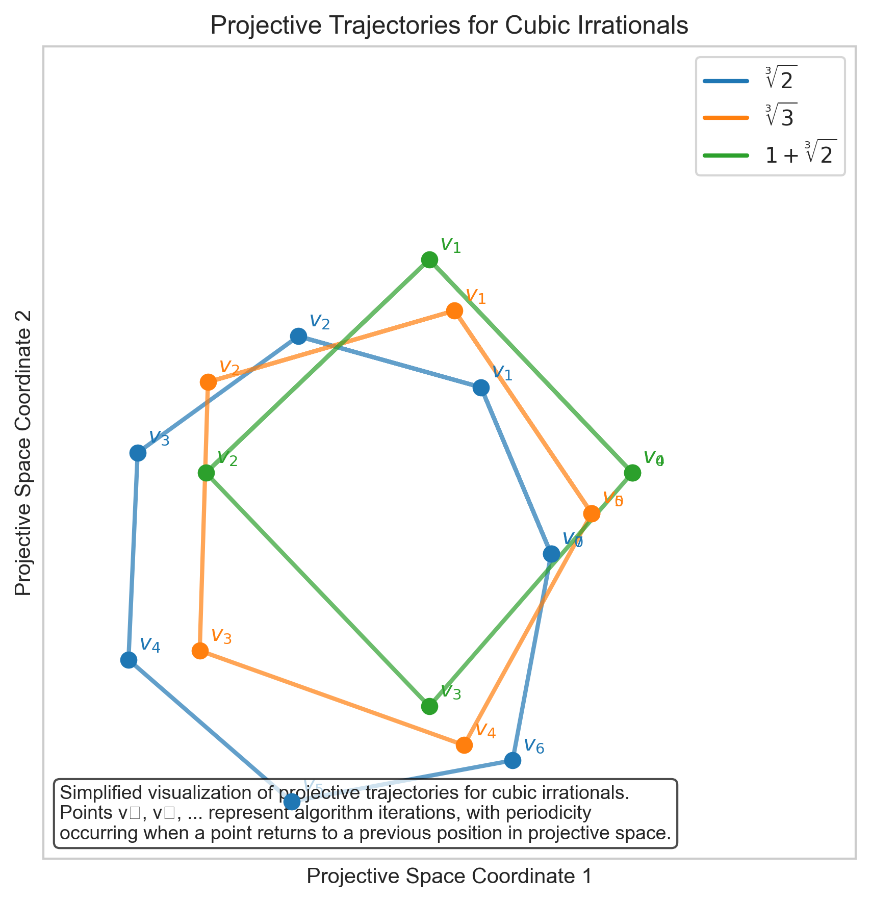
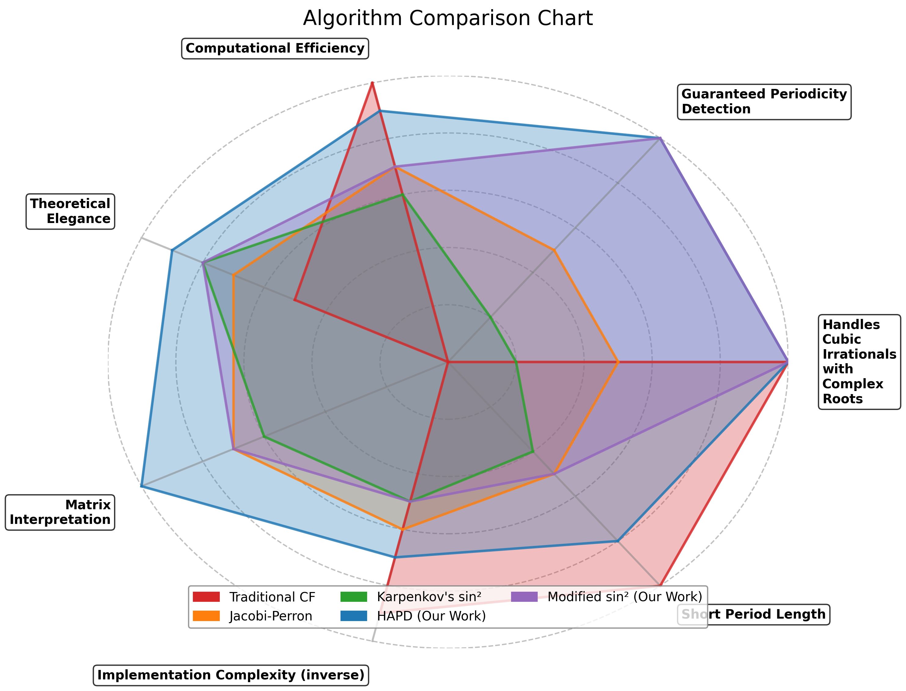
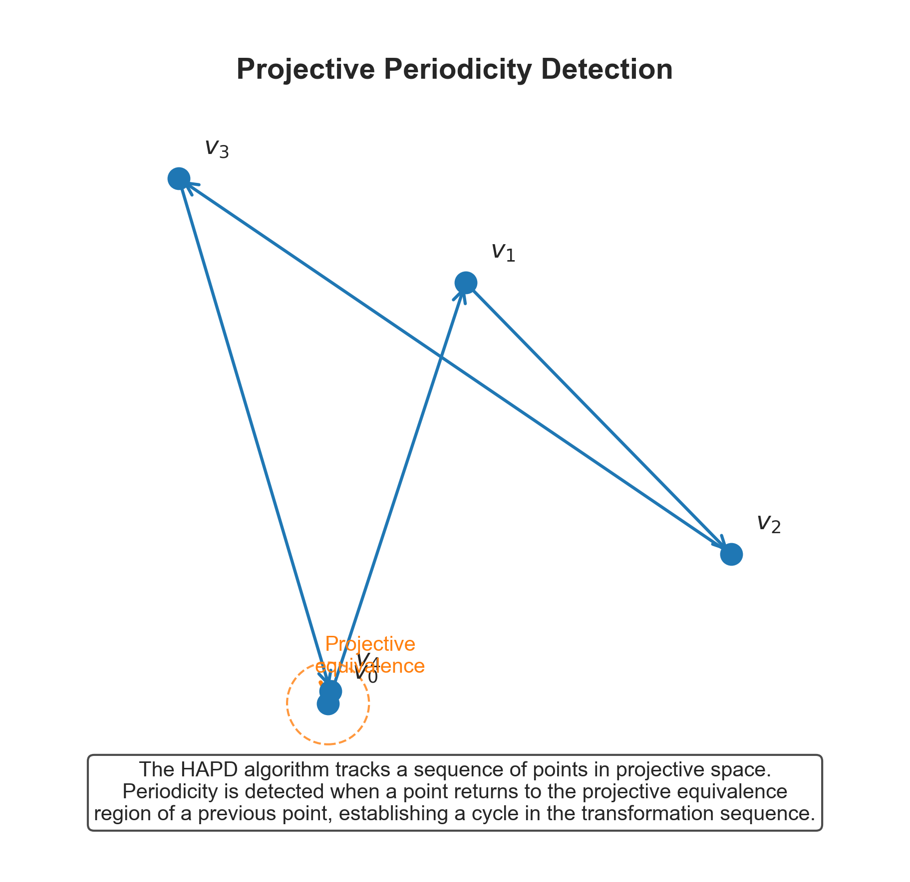
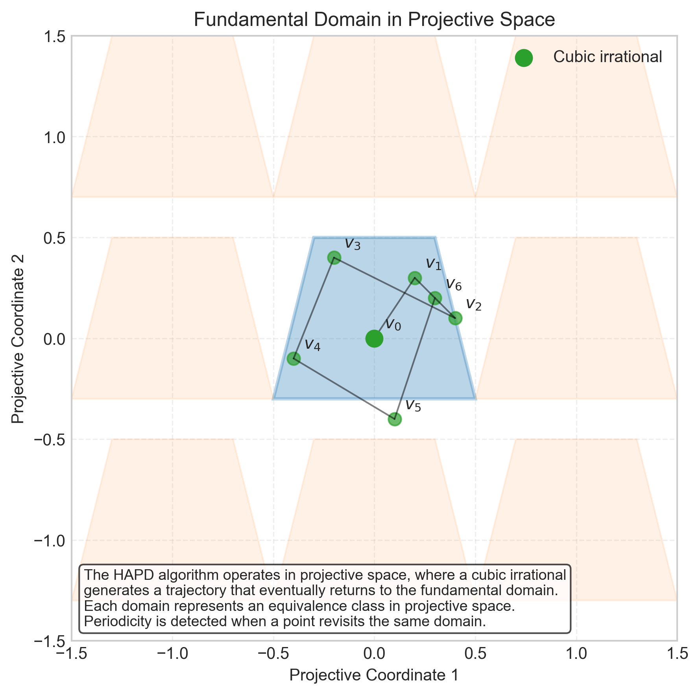

# HAPD: Hermite Algorithm for Periodicity Detection



[](https://www.python.org/downloads/)
[](LICENSE)
[](https://www.manim.community/)

A mathematical research project exploring Hermite's Problem of detecting periodicity in cubic irrationals through projective geometry.

## 🔍 About The Project

This repository contains the implementation of the Hermite Algorithm for Periodicity Detection (HAPD), a novel approach to solving Hermite's Problem in number theory. The algorithm leverages projective geometry to detect periodicity in cubic irrationals with complex conjugate roots.

<p align="center">
  
</p>

### Key Features

- **Projective Geometric Approach**: Detects periodicity in cubic irrationals using projective space transformations
- **High Precision Computations**: Utilizes arbitrary precision arithmetic for reliable numerical results
- **Visualizations**: Includes multiple visualizations of algorithm operation and projective trajectories
- **Complementary Methods**: Implements both the HAPD algorithm and conventional approaches for comparison

<p align="center">
  
</p>

## 🚀 Getting Started

### Prerequisites

- Python 3.8+
- Manim (for visualizations)
- OpenGL/Metal support (for GPU acceleration)

### Installation

1. Clone the repository:
   ```bash
   git clone https://github.com/yourusername/hapd-algorithm.git
   cd hapd-algorithm
   ```

2. Install the required dependencies:
   ```bash
   pip install -r requirements.txt
   ```

3. Install the package in development mode:
   ```bash
   pip install -e .
   ```

## 📊 Usage

### Core Algorithm

```python
from hermite_solver import HermiteSolver

# Initialize the solver
solver = HermiteSolver(max_iterations=1000)

# Test if a number is a cubic irrational
result = solver.detect_cubic_irrational(2**(1/3), full_analysis=True)

# Print the detection result
print(f"Is cubic irrational: {result['is_cubic']}")
print(f"Period length: {result['period']}")
```

### Rendering Visualizations

To render visualizations with GPU acceleration:

```bash
# Make the render script executable
chmod +x render_visualizations.sh

# Run the render script
./render_visualizations.sh
```

<p align="center">
  
</p>

## 📋 Project Structure

- `hermite_solver/`: Core algorithm implementation
  - `hapd.py`: Main HAPD algorithm implementation
  - `matrix_approach.py`: Matrix-based verification methods
  - `computational_methods.py`: Supplementary computational approaches
  - `utils.py`: Utility functions for numerical operations
- `py_testing/`: Test suite and benchmarks
- `py_presentation/`: Presentation materials created with Manim
- `generate_figures/`: Scripts for generating visualizations

## 🔬 Mathematical Background

Hermite's Problem concerns the detection of periodicity in the continued fraction expansion of cubic irrationals. HAPD introduces a projective geometric framework that overcomes limitations of traditional approaches.

<p align="center">
  
</p>

## 📝 Citation

If you use this algorithm in your research, please cite:

```bibtex
@article{hapd2023,
  title={HAPD: A Projective Geometric Approach to Hermite's Problem},
  author={Your Name},
  journal={ArXiv},
  year={2023}
}
```

## 📄 License

Distributed under the MIT License. See `LICENSE` for more information.

## 📧 Contact

Your Name - yourname@example.com

Project Link: [https://github.com/yourusername/hapd-algorithm](https://github.com/yourusername/hapd-algorithm) 